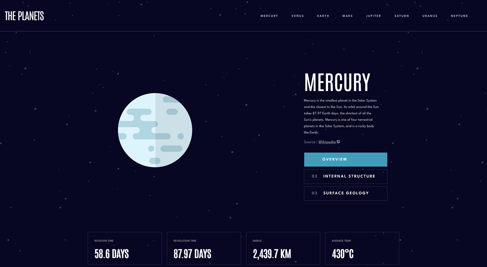

# Frontend Mentor - Planets fact site solution

This is a solution to the [Planets fact site challenge on Frontend Mentor](https://www.frontendmentor.io/challenges/planets-fact-site-gazqN8w_f). Frontend Mentor challenges help developers to improve their coding skills by building realistic projects. 

## Table of contents

- [Overview](#overview)
  - [The challenge](#the-challenge)
  - [Screenshot](#screenshot)
  - [Links](#links)
  - [Built with](#built-with)
  - [What I learned](#what-i-learned)
- [Author](#author)

## Overview

The challenge is to build an 8-page planet fact-site and make it look as close to the design as possible. Frontend Mentor provided design files and text-files for the challenge, and it was up to the developer to decide how to build the website, and what tools to use.

### The challenge

Users should be able to:

- View the optimal layout for the app depending on their device's screen size
- See hover states for all interactive elements on the page
- View each planet page and toggle between "Overview", "Internal Structure", and "Surface Geology"

### Screenshot

### Links

- Solution URL: [Solution URL](https://www.frontendmentor.io/solutions/planet-fact-site-l3Od_5yqnO)
- Live Site URL: [Live site URL](https://planet-fact-site-vue-edition.vercel.app/Mercury)

### Built with

- HTML5
- CSS custom properties
- Flexbox
- CSS Grid
- CSS media query
- Vue.js - version 3.3.10
- Vue Router - version 4.2.5

### What I learned

This project was a great oppurtunity for me to practise animations with Vue.js for both individual components and for animating loading different pages.

## Author

- Website - [Viktória Lukács](https://viktoria-lukacs-portfolio-site.web.app/)
- Github - (https://github.com/Luktoria)
